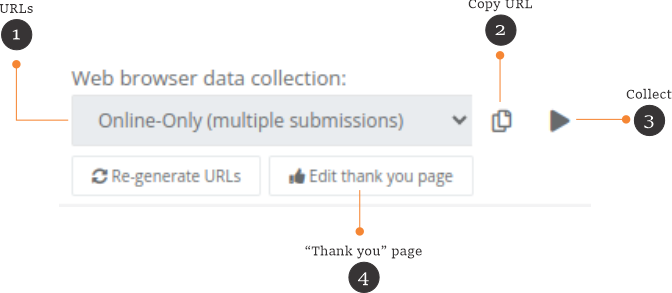
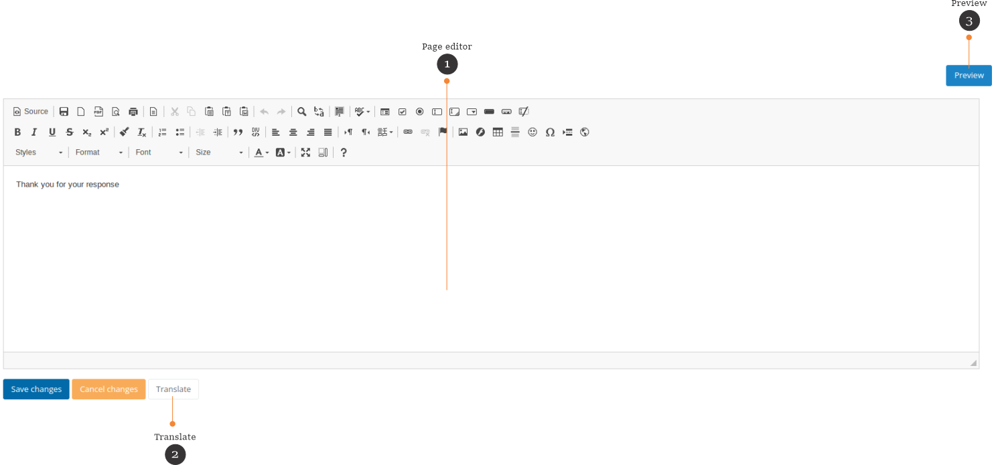
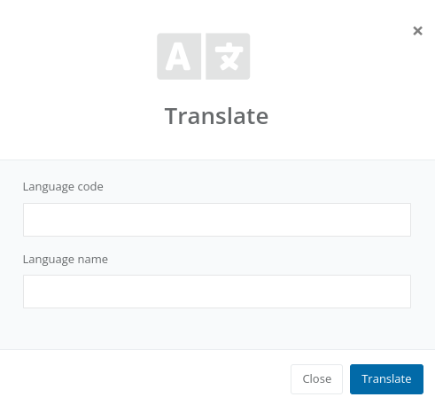
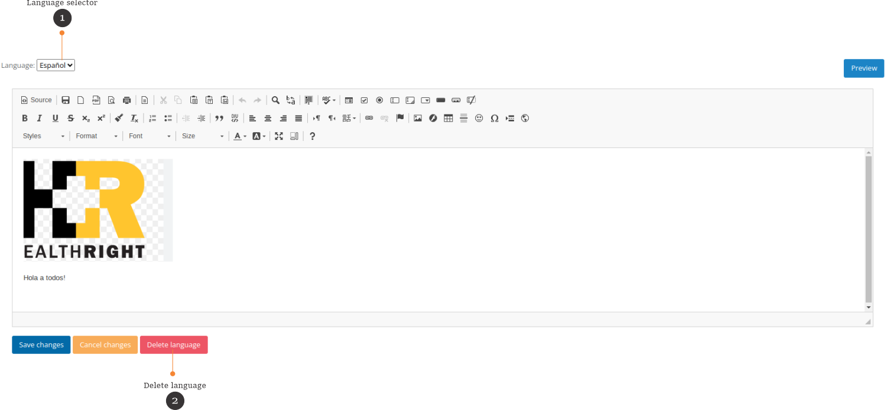

FormShare Enketo Plug-in
==============

This FormShare plug-in allows Internet Browser data collection using [Enketo](https://enketo.org/). This is useful for users that do not have an Android phone to collect data. You can either use the official Enketo service or the Docker server provided as part of this plug-in.

## Start the Enketo server

The easiest way to have an Enketo server running for FormShare is through the Docker Compose script as part of this plug-in

```shell
# Install Docker Compose if is not already installed
sudo apt-get install -y docker-compose
# Configure the docker directories
sudo mkdir /opt/enketo
whoami=$(whoami)
sudo chown $whoami /opt/enketo
mkdir /opt/enketo/secrets
mkdir /opt/enketo/config
mkdir /opt/enketo/redis
mkdir /opt/enketo/redis_cache
cd /opt/enketo
# Grab the plug-in source
git clone https://github.com/qlands/formshare_enketo_plugin.git
# Create a directory for the Docker Compose file
mkdir enketo_6.1.0
cd enketo_6.1.0
# Copy the Docker compose file from the source to the new directory
cp ../formshare_enketo_plugin/docker_compose/docker-compose.yml .
# Start the Enketo server
sudo docker-compose up -d
# Enketo will run on http://localhost:8005/enketo from there you can proxypass it
```

## Configure Enketo

The configuration file for Enketo will be at /opt/enketo/config/config.json

- Edit line 8 to setup a new API key

  ```json
  "api key": "myNewSecretAPIKey"
  ```

- Restart the Docker Enketo server along with the Redis servers

  ```shell
  sudo docker stop fsenketo
  sudo docker stop fsredis_main
  sudo docker stop fsredis_cache
  cd /opt/enketo_2.3.12
  sudo docker-compose up -d
  ```

Start the plug-in
---------------

- Activate the FormShare environment.

  ```shell
  . ./path/to/FormShare/bin/activate
  ```
- Change directory into your newly created plug-in.

  ```shell
  cd formshare_enketo_plugin
  ```
- Build the plug-in

  ```shell
  python setup.py develop
  python setup.py compile_catalog
  ```
- Add the plug-in to the FormShare list of plug-ins and the plug-in configuration to the development.ini file.

  ```ini
  #formshare.plugins = examplePlugin
  formshare.plugins = enketo
  
  enketo.url = http://localhost:8005/enketo/
  enketo.apikey = myNewSecretAPIKey
  ```
- Run FormShare again

## Use the plugin

### The Enketo tools

When the plug-in is activated the Enketo tools will appear in the "Links" section of the "Form Details" page.



1. Submission type. There are multiple URLs for collecting data. You can select one of the submissions types:
   - Online-Only (multiple submissions)
   - Online-Offline (multiple submission)
   - Online-Only (single submission). After submitting the data, Enketo will redirect the user to the "Thank you page".
   - Online-only (once per respondent). This will allow only one respondent per computer. After submitting the data, Enketo will redirect the user to the "Thank you page".
   - View only (for testing). This URL will not submit any data.
2. Click on this button to copy the current URL.
3. Click on this button to start collecting data using the current submission type.
4. You can configure the "Thank you" page for "single submission" and "once per respondent".

### The "Thank you" page

You can customize your "Thank you page" as you like. The Enketo plug-in uses [CKEditor](https://ckeditor.com/) to help you customize your "Thank you page".



1. Use the page editor to edit your "thank you" page. You can upload images, add tables, links, colors, etc.
2. Use the "Translate" button to translate the content of your page.
3. Click on the "Preview" button to see the result.

You can translate the "Thank you" page to any language. Click on the translate button to add a new language.



The plug-in will copy the default content to the new language. You can have different content in each language.



1. Use the language selector to move between the default screen and the languages that you have.
2. Use the delete language button to delete any language.
